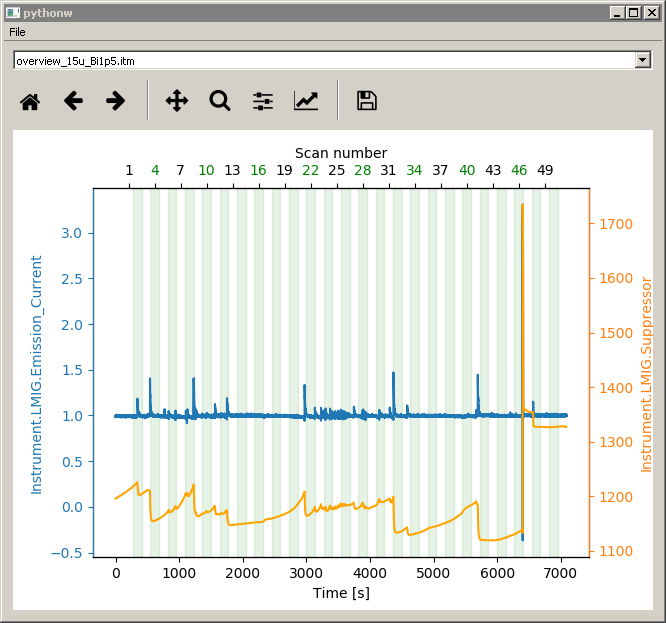
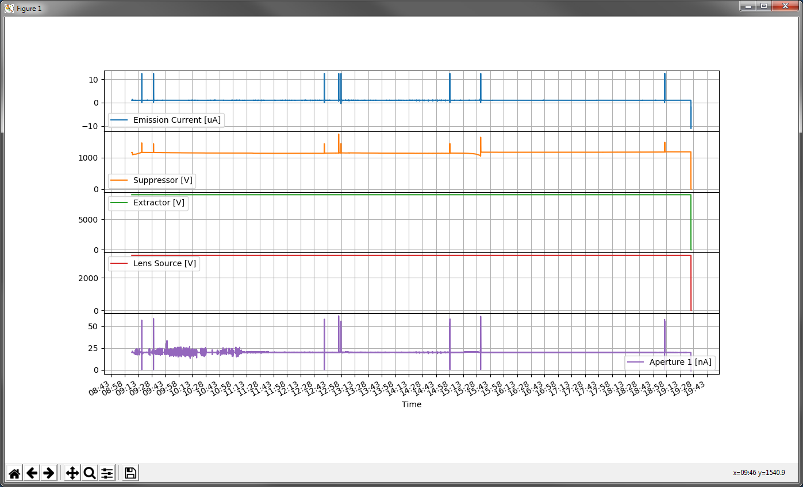
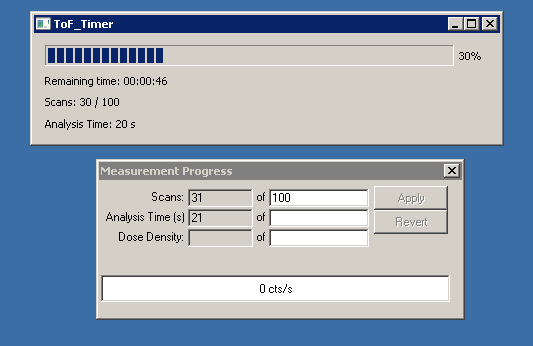
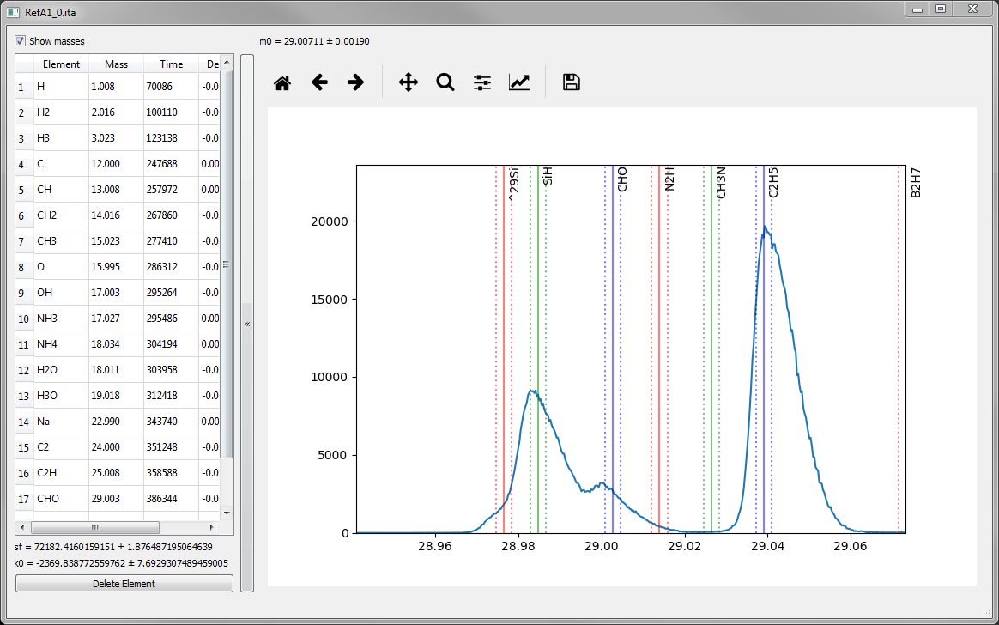

[](https://pepy.tech/project/pyspm)
[](https://pypi.python.org/pypi/pySPM/)
[](https://opensource.org/licenses/Apache-2.0)
[](https://doi.org/10.5281/zenodo.998575)

# pySPM

pySPM is a Python library in order to read, handle and plot Scanning Probe Microscopy 
(SPM) images as well as ToF-SIMS data.

Supported SPM file formats:

* Nanoscan .xml file format
* Bruker
* Iontof ToF-SIMS fileformats:
    * ITA
    * ITM
    * ITS
* Nanonis SXM file

## Important

This library is offered as it is and is still in development. Please note that reading
the raw data was done by reverse
engineering and guessing and not with a manual as the file format is proprietary. It
seems to work well with the data
used by the developer of this library, but there is **NO GUARANTEE** that this library
will work correctly with your own
specific data.

If you find bugs and issues, please report them to the
developer: https://github.com/scholi/pySPM/issues

## Installation

### From PyPI

```bash
pip install pySPM
```

### From GitHub

#### With poetry

```bash
poetry add git+https://github.com/scholi/pySPM.git
```

#### With pip

```bash
pip install git+https://github.com/scholi/pySPM.git
```

### Optional dependencies

`PyQT5` for GUI controls.

## Documentation

The documentation is still in its early stage
[read the documentation](https://nbviewer.jupyter.org/github/scholi/pySPM/blob/master/doc/pySPM%20Documentation.ipynb)

There is also
a [short introduction to pySPM for ToF-SIMS data](https://nbviewer.jupyter.org/github/scholi/pySPM/blob/master/doc/Introduction%20to%20pySPM%20for%20ToF-SIMS%20data.ipynb)

## Citing

If you use this library for your work, please think about citing it.
[](https://doi.org/10.5281/zenodo.998575)

Olivier Scholder. (2018, November 28). scholi/pySPM: pySPM v0.2.16 (Version v0.2.16).
Zenodo. http://doi.org/10.5281/zenodo.998575

## News

### ITA files are writable

From now on you can, not only view the ita files, but you can also write them by
supplying the parameter
_readable=False_ to _pySPM.ITA_ or _pySPM.ITM_. For the moment this is still a
non-user-friendly procedure, but you can
edit each ITStr Block with the ```edit_block()``` function. Be careful, because if the
new data has a different size
than the old one, a new block is created, but the old one is also kept. This means that
your ITA file size will grow.
You can also add new channels and images with the more user-friendly
function ```pySPM.ITA.add_new_images()```.
:warning: It is highly advised to copy the ita file before making any change. You can
use the following code to copy the
ita in a temporary ita before making any change.

```python
from shutil import copyfile
import pySPM

filename = "scanfile.ita"
copyfile(src=filename, dst="temp.ita")
A = pySPM.ITA("temp.ita", readonly=False)
```

### New tools

The library comes with three scripts to make your life easier. Those scripts are located
in your python folder in the
Scripts directory. You can also run them from the command line.

#### stability

Allows you to select a measurement folder and display the Emission Current and
Suppressor voltage in function of the
time/scan number.
This allows you to verify the stability of your source during your measurements.


see the [wiki](../../wiki/stability) for more info

#### plotter

Allows you to plot the parameter logged by your logfile. If SurfaceLab is running this
script will detect which logfile
is beeing saved and will display the values live (the plot is refreshed every 3s in
order add the new data). You can
also provide as first argument the logfile path (or in windows you can drag&drop the
logfile over the plotter app).


see the [wiki](../../wiki/plotter) for more info

#### timer

If you are using SurfaceLab, this app will display a small progressbar of your
measurement and will calculate the
remaining time in function of the elapsed time, the total number of scans and the
elapsed number of scan.


see the [wiki](../../wiki/timer) for more info

#### spectra

This tool can display spectra, visualize rapidly peaks assignment and perform fast mass
calibration.
You can give an ITA filename as argument or if none a GUI filedialog will ask you for
one. You will then see your
spectrum.
You can navigate with the scroll of the mouse to zoom in & out. You can use the
keyboard <kbd>+</kbd> and <kbd>-</kbd>
to shift your spectra by ±1 Dalton. You can use left-mouse-button and drag to shift your
spectra. You can perform very
quick mass calibration by Right-Mouse-Click on one measurement peak (hold the mouse) the
move to the element mark you
want to assign your peak and release the mouse. The mass calibration values should then
be updated on the left table and
the mass calibration performed live so that you can see immediately the changes.


see the [wiki](../../wiki/spectra) for more info
