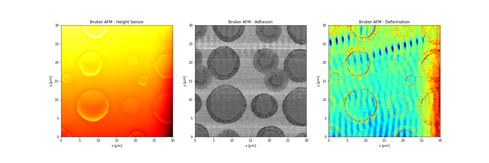
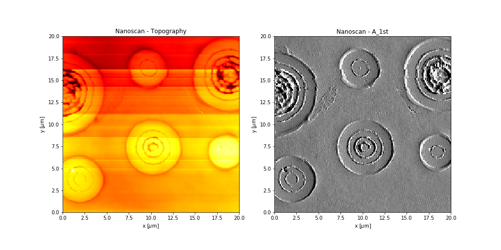

A tutorial to read and handle AFM data with the pySPM library
=============================================================

It exists various instrument manufacturer and we try to provide a large variety of file format. For the moment the library allows the user to read:

* Bruker AFM
* Nanoscan xml files
* Nanonis SXM files

Bruker AFM
----------

Loading the data::
    >>> scan = pySPM.Bruker('../pySPM/data/CristC_pos1.002')
    >>> scan.list_channels()
    Channels
    =======
        S [ZSensor] "Height Sensor"
        S [ZSensor] "Height Sensor"
        S [] "Peak Force Error"
        S [SneddonModulus] "Sneddon Modulus"
        S [] "Log Sneddon Modulus"
        S [Adhesion] "Adhesion"
        S [Dissipation] "Dissipation"
        S [Deformation] "Deformation"
    >>> topo_forward = scan.get_channel()
    >>> topo_backward = scan.get_channel(backward=True)
    >>> adhesion = scan.get_channel("Adhesion", True)
    >>> deformation = scan.get_channel("Deformation")

Be careful some data are only available on the forward direction (like here "adhesion") and some other only on the backward direction (like here "Adhesion"). If you get an error "Channel xxxx not found", try to change the backward value.

You can then see the data::
    >>> fig, ax = plt.subplots(1, 3, figsize=(21, 7))
    >>> topo_forward.show(ax=ax[0], cmap='hot')
    >>> adhesion.show(ax=ax[1])
    >>> deformation.show(ax=ax[2], cmap='jet', sig=2);

Nanoscan xml
------------

Loading the data::
    >>> scan = pySPM.Nanoscan("../pySPM/data/CristA_0002.xml")
    >>> scan.list_channels()
    forward
    =======
      - Normal Deflection
      - FreeResAmpl
      - A_1st
      - Topography
    |
    backward
    ========
      - Normal Deflection
      - FreeResAmpl
      - A_1st
      - Topography
    |
    >>> print(Scan.getSummary())
    Feedback: A_1st : P:1.6m/m : I:3.0ms
    Size: 256×256 pixels = 20.0 um×20.0 um
    Scan Speed: 6.0s/line
    >>> topo = scan.get_channel()
    >>> a1st = scan.get_channel("A_1st")
    >>> fig, ax = plt.subplots(1, 2, figsize=(14,7))
    >>> topo.show(ax=ax[0])
    >>> a1st.show(ax=ax[1], sig=2);

Nanonis SXM data
----------------
Loading the data::
    >>> scan = pySPM.SXM("../pySPM/data/test.sxm")
    >>> scan.list_channels()
    Channels
    ========
      - Z
      - Current
    >>> fig, ax = plt.subplots(1, 2, figsize=(14, 7))
    >>> scan.get_channel("Z").show(ax=ax[0])
    >>> current = scan.get_channel("Current")

    
fig, ax = plt.subplots(1,2,figsize=(15,7))
S.get_channel('Z').show(ax=ax[0]);
p = S.get_channel('Current').show(ax=ax[1], cmap='viridis');
